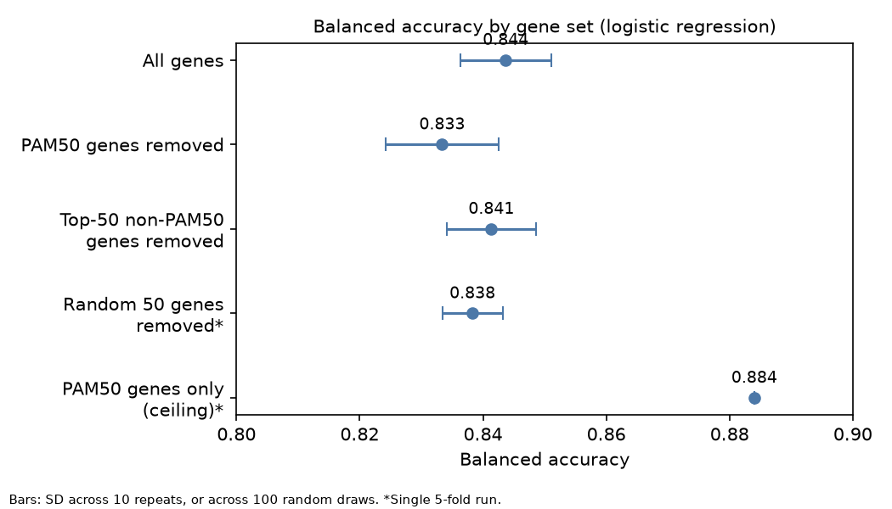
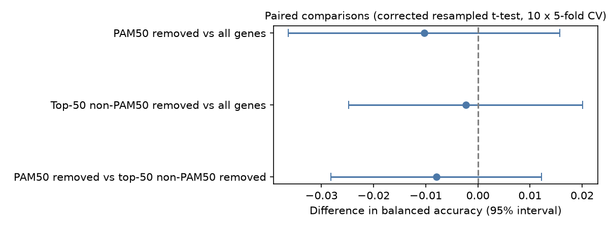
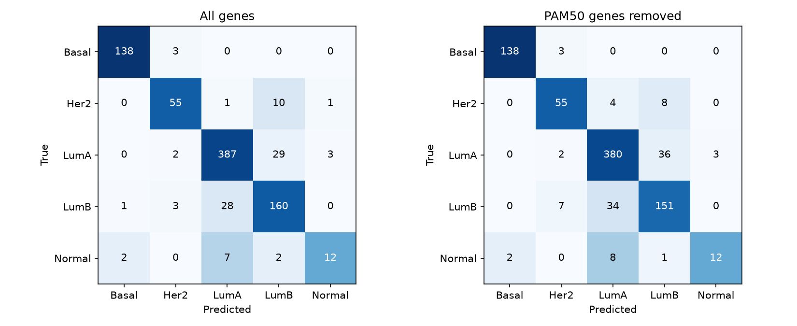
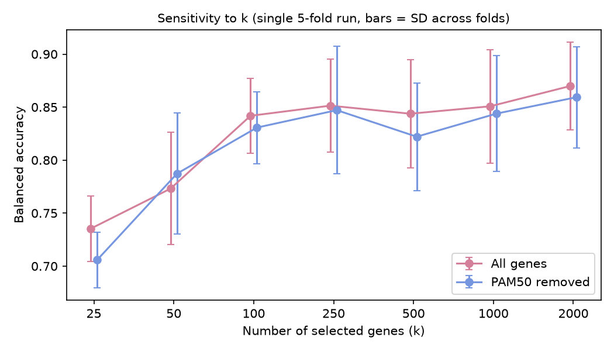

# Beyond PAM50: Recovering Breast Cancer Molecular Subtypes from Transcriptome-Wide Expression

[](https://www.python.org/)
[](https://numpy.org/)
[](https://pandas.pydata.org/)
[](https://scikit-learn.org/)
[](https://www.cancer.gov/ccg/research/genome-sequencing/tcga)
[](LICENSE)

## Overview

Breast cancer comprises biologically distinct molecular subtypes that can be identified from gene-expression patterns using the **50-gene PAM50 classification**.

This project investigates whether these subtype patterns can be recovered from genome-wide RNA-seq expression data **without using the canonical PAM50 genes**, or whether subtype information is distributed more broadly across the transcriptome.

Using TCGA breast cancer (TCGA-BRCA) RNA-seq data, I trained machine-learning models to classify the five PAM50 molecular subtypes and compared performance when:

1. Using genome-wide gene expression
2. Removing all 50 PAM50 genes
3. Removing the 50 most informative non-PAM50 genes
4. Removing randomly selected genes as a control

The results suggest that **PAM50-associated subtype information is distributed broadly across the transcriptome rather than being confined to the 50 canonical genes**.

> **Key result:** Logistic regression achieved a balanced accuracy of **0.844** using genome-wide expression and **0.833** after removing all 50 PAM50 genes. This difference was not statistically distinguishable from zero using a corrected resampled t-test (*p* = 0.43).

Importantly, this study evaluates **recovery of PAM50-derived labels**, not prediction of clinical outcomes such as survival or treatment response.

---

## Key Findings

| Gene set                                   | Balanced accuracy |
| ------------------------------------------ | ----------------: |
| All 20,530 genes                           | **0.844 ± 0.007** |
| PAM50 genes removed                        | **0.833 ± 0.009** |
| Top 50 informative non-PAM50 genes removed | **0.841 ± 0.007** |

Values are mean ± SD across 10 repeats of 5-fold cross-validation.

* Genome-wide expression classified the five PAM50 subtypes with a balanced accuracy of **0.844**.
* Removing all 50 PAM50 genes reduced performance to **0.833**.
* This decrease of **0.010** was not statistically distinguishable from zero (*p* = 0.43).
* Removing the 50 most informative non-PAM50 genes reduced performance by only **0.002**.
* The difference between the PAM50 removal and informative non-PAM50 removal was **0.008** (*p* = 0.43).
* The model therefore retained almost all of its classification performance without seeing any PAM50 genes.
* **Most classification errors occurred between Luminal A and Luminal B**, rather than being distributed evenly across the five subtypes.
* The results support the idea that subtype-associated transcriptional information is **redundant and distributed across many genes**.

Chance performance for five equally weighted classes is **0.20**.

---

## Main Result



*Balanced accuracy for each gene set. Bars show the SD across 10 repeats of 5-fold cross-validation. The random-gene row is a single cross-validation split, with bars showing the SD across 100 random draws. The "PAM50 genes only" row is a ceiling for reference: the label is computed from those genes, so it is not an independent result.*

The main comparison shows that removing the PAM50 genes causes only a modest reduction in classification performance.

The model does not need direct access to the genes used to define the PAM50 classification to recover the subtype labels with similar accuracy. This suggests that the information represented by PAM50 is also reflected in broader patterns of gene expression.

---

## Dataset

The analysis uses the **TCGA-BRCA** cohort downloaded from **UCSC Xena**.

### Expression data

* Dataset: `TCGA.BRCA.sampleMap/HiSeqV2`
* 20,530 genes
* 1,218 samples
* RNA-seq expression data

### Clinical data

* Dataset: `TCGA.BRCA.sampleMap/BRCA_clinicalMatrix`
* PAM50 subtype label: `PAM50Call_RNAseq`

The expression dataset contains:

* 1,097 primary tumours
* 114 normal tissue samples
* 7 metastatic samples

Only primary tumours with an available PAM50 call were retained, giving **844 samples**.

| PAM50 subtype | Samples |
| ------------- | ------: |
| Luminal A     |     421 |
| Luminal B     |     192 |
| Basal         |     141 |
| HER2          |      67 |
| Normal-like   |      23 |
| **Total**     | **844** |

The **Normal-like** class refers to the PAM50 molecular subtype and should not be confused with the normal tissue samples, which were excluded.

---

## Methods

### Machine-learning models

Two classifiers were evaluated:

* **Logistic regression**
* **Random forest**

Both models used balanced class weights to account for the substantial class imbalance.

Logistic regression performed better overall and was therefore used for the main analysis.

### Preprocessing and feature selection

The modelling pipeline was:

1. Remove constant genes
2. Select the **500 genes with the highest ANOVA F-score**
3. Standardise the selected features
4. Fit the classifier

The value **k = 500** was fixed before comparing the different gene sets.

Feature selection was performed **inside each cross-validation fold**. This prevents information from the test set influencing feature selection and avoids data leakage.

### Evaluation

Performance was measured using **balanced accuracy**, which gives equal weight to each of the five molecular subtypes.

This is preferable to ordinary accuracy because the dataset is highly imbalanced. For example, Luminal A contains 421 samples while Normal-like contains only 23.

### Cross-validation

Performance was estimated using:

* 5-fold cross-validation
* 10 independent repeats
* 50 paired fold scores

The same cross-validation splits were used for each gene set so that comparisons could be made on paired predictions.

---

## PAM50 Gene Removal

All 50 PAM50 genes were identified in the expression matrix.

Three genes required alternative gene-symbol mappings:

| PAM50 symbol | Expression-data symbol |
| ------------ | ---------------------- |
| KNTC2        | NDC80                  |
| CDCA1        | NUF2                   |
| ORC6         | ORC6L                  |

The complete PAM50 gene set was then removed before feature selection and model fitting.

---

## Control Experiments

Two control experiments were included.

### Random-gene control

Random genes were removed to establish how much performance changes when largely uninformative genes are excluded.

### Informative non-PAM50 control

The 50 most informative genes outside the PAM50 set were identified using ANOVA F-scores and removed.

This provides a more stringent comparison because these genes are expected to contain substantial subtype information.

The informative-gene control therefore asks whether removing PAM50 genes has a larger effect than removing an equivalent number of other highly informative genes.

---

## Statistical Testing

Differences between gene sets were assessed using the **corrected resampled t-test of Nadeau and Bengio**.

This accounts for the dependence between cross-validation results caused by overlapping training sets.

Because the same cross-validation splits were used for each gene set, fold-level results could be directly paired.

---

# Results

## Main Classification Results

Logistic regression, 10 repeats of 5-fold cross-validation:

| Gene set                                   | Balanced accuracy |
| ------------------------------------------ | ----------------: |
| All 20,530 genes                           | **0.844 (0.007)** |
| PAM50 genes removed                        | **0.833 (0.009)** |
| Top 50 informative non-PAM50 genes removed | **0.841 (0.007)** |

Values are mean ± SD across the 10 repeats.

### Statistical comparisons

| Comparison                                | Mean difference | *p*-value |
| ----------------------------------------- | --------------: | --------: |
| PAM50 removed vs all genes                |          -0.010 |      0.43 |
| Top 50 non-PAM50 removed vs all genes     |          -0.002 |      0.84 |
| PAM50 removed vs top 50 non-PAM50 removed |          -0.008 |      0.43 |



*Differences in balanced accuracy with 95% intervals, from the corrected resampled t-test on 10 x 5-fold cross-validation. The dashed line marks no difference.*

All three comparisons included zero within their 95% intervals.

The results therefore provide **no statistically significant evidence that removing the PAM50 genes causes a larger performance loss than removing an equivalent number of informative non-PAM50 genes**.

This does not prove that PAM50 genes have no effect. Rather, it suggests that their subtype information is substantially redundant with information contained in other genes.

---

## Subtype Confusion



*Counts of true subtype (rows) against predicted subtype (columns) for logistic regression, single seed-42 run. Left: all genes. Right: PAM50 genes removed. Colour shows the share of each true subtype.*

The model did not make errors equally across all five subtypes.

The main source of confusion was **Luminal A versus Luminal B**.

In the single seed-42 run:

* 30 Luminal A tumours were classified as Luminal B
* 24 Luminal B tumours were classified as Luminal A

After removing the PAM50 genes, this confusion increased slightly:

* 39 Luminal A tumours were classified as Luminal B
* 30 Luminal B tumours were classified as Luminal A

This is biologically plausible because Luminal A and Luminal B have overlapping transcriptional characteristics and can be viewed as occupying related regions of the breast cancer expression landscape.

The PAM50 genes therefore appear to contribute to distinguishing these closely related Luminal subtypes, but removing them does **not** eliminate the broader transcriptional signal that allows the model to distinguish the groups.

### Other subtype performance

Basal tumours were classified particularly well, while the Normal-like subtype was the most difficult to identify.

The Normal-like subtype had a recall of **0.65** in the all-gene model and contains only **23 samples**, making its performance estimate relatively uncertain.

---

## Per-Subtype Performance

Logistic regression using all genes, single run with seed 42:

| Subtype     | Precision | Recall |
| ----------- | --------: | -----: |
| Basal       |      0.99 |   0.98 |
| Luminal A   |      0.93 |   0.91 |
| Luminal B   |      0.79 |   0.84 |
| HER2        |      0.81 |   0.84 |
| Normal-like |      0.75 |   0.65 |

The strongest performance was observed for Basal tumours.

The weakest performance was observed for Normal-like tumours, consistent with the very small number of samples in this class.

---

## Reference Models

A single 5-fold cross-validation run using seed 42 produced the following reference results:

| Model                                         | Balanced accuracy |
| --------------------------------------------- | ----------------: |
| Always predict Luminal A                      |             0.200 |
| Logistic regression — PAM50 genes only        |             0.884 |
| Logistic regression — all genes               |             0.844 |
| Logistic regression — PAM50 removed           |             0.822 |
| Random forest — all genes                     |             0.815 |
| Random forest — PAM50 removed                 |             0.818 |
| Logistic regression — 50 random genes removed |     0.838 ± 0.005 |

The single-run PAM50-removal result (0.022 decrease) is larger than the repeated-CV estimate (0.010).

This demonstrates why the repeated cross-validation results are used for the main conclusions: individual train/test splits can produce noticeable variation in performance.

---

## Sensitivity to Number of Genes

Although **k = 500** was fixed for the main analysis, a sensitivity analysis evaluated how performance changed as the number of selected genes varied.



*Balanced accuracy against the number of selected genes (k), single 5-fold run. Bars show the SD across folds.*

Performance increased as more genes were included, from approximately **0.71–0.74 at 25 genes** to **0.86–0.87 at 2,000 genes**.

Across the range tested, the all-gene and PAM50-removed models remained within approximately **0.03** of one another. This is comparable to the fold-to-fold variability observed in the analysis.

At **k = 50**, the PAM50-removed model even slightly outperformed the model using all genes.

Overall, the sensitivity analysis supports the main result that subtype-associated information is not restricted to the canonical PAM50 genes.

---

# Interpretation

The results support the conclusion that **information associated with PAM50 molecular subtypes is distributed across a much broader transcriptional programme**.

The PAM50 genes provide a compact and highly informative representation of subtype identity, but they are not the only genes that contain information about those labels.

One possible explanation is that genes involved in related biological programmes are co-expressed. For example, transcriptional programmes associated with **cell proliferation, oestrogen signalling, and other subtype-related processes** can generate correlated patterns across many genes.

As a result, removing the PAM50 genes does not remove the underlying transcriptional information that the machine-learning model uses to distinguish the subtypes.

The main conclusion is therefore:

> **A machine-learning model can recover PAM50 subtype labels with only a modest reduction in performance when all 50 PAM50 genes are excluded.**

---

# Limitations

### Labels are derived from the expression data

The PAM50 labels are calculated from the same RNA-seq expression profiles used as model inputs.

Therefore, this study demonstrates **recovery of a computationally derived molecular label**, rather than independent prediction of a clinical outcome.

It does not demonstrate prediction of survival, treatment response, recurrence, or other clinical endpoints.

### A small performance reduction may still be meaningful

The lack of statistical significance does not demonstrate that removing PAM50 genes has exactly zero effect.

The estimated reduction is approximately **0.01 balanced accuracy**, and the study may not have sufficient power to distinguish an effect of this size from zero.

### Luminal A and Luminal B overlap

A substantial proportion of classification errors occur between Luminal A and Luminal B.

This reflects the similarity between their transcriptional profiles and means that overall classification performance should not be interpreted as perfect separation of all five subtypes.

### Small Normal-like class

Only 23 samples belong to the Normal-like subtype, making performance estimates for this class relatively uncertain.

### Informative-gene control

The 50 non-PAM50 genes were ranked using the full labelled dataset. This control is therefore not a completely leakage-free feature-selection experiment.

However, the genes are subsequently removed rather than selected for model fitting, so this procedure does not provide the model with additional predictive information.

### No gene-level interpretation

The current analysis focuses on classification performance and does not investigate which genes the models use or whether particular biological pathways drive classification.

### No external validation

The analysis uses a single TCGA cohort and does not test whether the findings generalise to an independent breast cancer dataset.

---

# Reproducibility

## Requirements

Developed using:

* Python 3.14
* NumPy 2.5
* pandas 3.0
* scikit-learn 1.9

## Installation

```bash
python3 -m venv .venv
source .venv/bin/activate
pip install -r requirements.txt
```

## Run the analysis

Download the data:

```bash
python datadownload.py
```

Run the models and statistical analyses:

```bash
python model.py
```

Generate the figures:

```bash
python charts.py
```

The analysis writes result tables to `results/` and figures to `figures/`.

`model.py` takes several minutes to run. The random-gene control is the slowest component. During development, `N_RANDOM_CONTROLS` near the top of `model.py` can be reduced to speed up testing.

---

# Repository Structure

```text
.
├── datadownload.py
├── model.py
├── charts.py
├── requirements.txt
├── README.md
├── LICENSE
│
├── data/
│   └── ...
│
├── results/
│   ├── summary.csv
│   ├── k_sensitivity.csv
│   └── paired_tests.csv
│
└── figures/
    ├── balanced_accuracy.png
    ├── paired_differences.png
    ├── confusion_matrices.png
    └── k_sensitivity.png
```

## Scripts

| File               | Purpose                                                                      |
| ------------------ | ---------------------------------------------------------------------------- |
| `datadownload.py`  | Downloads the TCGA-BRCA datasets from UCSC Xena                              |
| `model.py`         | Runs preprocessing, models, controls, cross-validation and statistical tests |
| `charts.py`        | Generates figures from the analysis outputs                                  |
| `requirements.txt` | Python dependencies                                                          |

---

# Conclusion

This project shows that **PAM50 breast cancer molecular subtype labels can be recovered from transcriptome-wide expression patterns even when the canonical PAM50 genes are removed**.

The modest reduction in classification performance after PAM50 removal, combined with the informative-gene control, supports the idea that subtype-associated information is **distributed across correlated transcriptional programmes rather than being uniquely encoded by the PAM50 genes**.

The main classification errors occur between **Luminal A and Luminal B**, which is consistent with their overlapping transcriptional profiles.

These findings should be interpreted specifically as evidence for **redundancy in the transcriptional information underlying PAM50 labels**, rather than as evidence that PAM50 genes are biologically unimportant or that the model can predict clinical outcomes.

---

## Data Source

Expression and clinical data were obtained from **UCSC Xena** using the TCGA-BRCA cohort.

The analysis code in this repository is intended to make the computational workflow reproducible.
